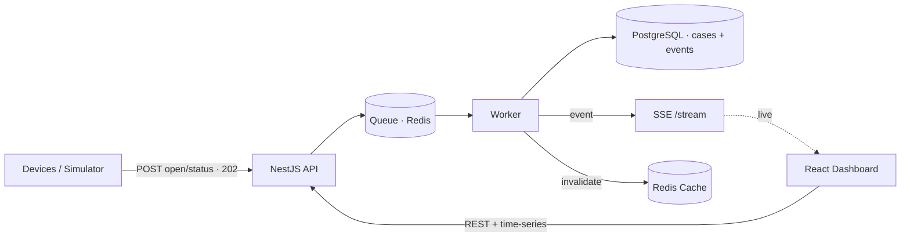

# Real-Time Traffic Incident Management Platform

Ingests traffic incidents from roadside devices as **cases with a status timeline**,
processes them through a queue, and streams them to an operator dashboard in real time.

- **Backend** — NestJS, Drizzle (PostgreSQL), BullMQ, Server-Sent Events, Redis
- **Frontend** — React + Vite, TanStack Query, Recharts, Tailwind
- **Model** — an **OPEN** starts a case (server returns its id); later **status events**
  update it (recorded in an append-only timeline). Current status = the **latest event by
  event-time**, so out-of-order arrivals (e.g. `ACKNOWLEDGED` after `RESOLVED`) don't regress.
- **Pipeline** — `POST open/status → queue → worker → cases+events → domain event → SSE + cache invalidation`



The backend, Postgres and Redis run in Docker; the dashboard and simulator are standalone
static SPAs (run locally or deploy to Netlify/Vercel).

## Services & ports

| Service | Port | Runs in | Role |
|---|---|---|---|
| **Backend API** (NestJS) | 4000 | Docker | REST (ingest, list/filter, status update, stats), the **SSE stream** (`/api/stream`), and the **BullMQ worker** that persists queued incidents. Swagger at `/api/docs`. |
| **Dashboard** (React/Vite) | 5173 | local / Netlify-Vercel | Operator UI: incident table, filters, detail drawer, summary cards, live updates via SSE. |
| **Simulator app** (React/Vite) | 5174 | local / Netlify-Vercel | Generates incident traffic in the browser → `POST /incidents/batch`, with scenario controls and a **configurable backend endpoint**. |
| **PostgreSQL** | 5432 | Docker | Incident storage (single `incidents` table). |
| **Redis** | 6379 | Docker | Backs the BullMQ ingestion queue **and** the statistics cache. |

The **CLI generator** (`backend/src/simulator/`) has no port — it's a script run via
`npm run simulate` or `docker compose exec`. Override the API port with
`API_PORT=… docker compose up`.

## Quick start

**1. Backend + infrastructure** (Docker) — Postgres, Redis, and the API which
auto-migrates on boot:

```bash
docker compose up --build
```

API + Swagger → http://localhost:4000/api/docs (override with `API_PORT=… docker compose up`).

**2. Frontend** (http://localhost:5173):

```bash
cd frontend
cp .env.example .env   # VITE_API_URL defaults to http://localhost:4000/api
npm install
npm run dev
```

**3. Generate traffic** — two options:

*Simulator app* (browser UI, http://localhost:5174) — interactive, with scenario controls:

```bash
cd simulator
cp .env.example .env   # VITE_API_URL defaults to http://localhost:4000/api
npm install
npm run dev
```
Set the **Backend endpoint** (defaults to `http://localhost:4000/api`), pick a **Count**
(quick presets **100 / 1,000 / 10,000**, or type one), choose one-shot or continuous mode, a
**Progress %** (share of opened cases advanced OPEN→ACKNOWLEDGED→IN_PROGRESS→RESOLVED), and an
**Inject out-of-order** toggle (sends a case's status events in shuffled arrival order to
exercise the latest-by-event-time rule). Optionally pin case attributes (severity / eventType
/ device / location). **Batch size** = incidents per request (≤ 1000); **Rate** = target
incidents/sec, best-effort (the panel shows the **actual** achieved rate). Flip to the
dashboard to watch cases open and resolve live — one row per case, not per status. A **Clear
all data** button (confirmed) wipes everything via `DELETE /api/incidents`.

*CLI* (scripted / headless / CI) — opens cases in bulk (100 / 1k / 10k):

```bash
docker compose exec backend node dist/simulator/simulate.js --count=1000 --rate=50
# or locally from backend/:  npm run simulate -- --count=10000 --batch=200
```
Flags: `--count` (total), `--batch` (per request), `--rate` (incidents/sec; `0` = max), `--url`.

**Clear all data** — wipes the `incidents` table, drains the ingestion queue, and resets
the stats cache. Same operation as the simulator's *Clear all data* button (`DELETE
/api/incidents`):

```bash
docker compose exec backend node dist/db/clear.js
# or locally from backend/:  npm run db:clear
```

> Prefer the backend with hot reload? `docker compose up -d postgres redis`, then
> `cd backend && cp .env.example .env && npm install && npm run db:migrate && npm run start:dev`.

## Deploy the frontends (Netlify / Vercel)

Both the dashboard and the simulator are static SPAs with `netlify.toml` + `vercel.json`
(build command, output dir, SPA fallback) in their folders. On the platform, set
**`VITE_API_URL`** to your deployed backend's URL, and add each deployed origin to the
backend's **`CORS_ORIGIN`** (comma-separated) so cross-origin REST and SSE are allowed.

## How the frontend talks to the backend

Both channels use one base URL from [frontend/src/config.ts](frontend/src/config.ts)
(`VITE_API_URL`, default `http://localhost:4000/api`):

- **REST** → [api/client.ts](frontend/src/api/client.ts) → calls in [api/incidents.ts](frontend/src/api/incidents.ts)
- **SSE** (`${VITE_API_URL}/stream`) → [lib/stream.ts](frontend/src/lib/stream.ts) →
  [hooks/useIncidentStream.ts](frontend/src/hooks/useIncidentStream.ts)

Point at another backend by setting `VITE_API_URL` in `frontend/.env` (local) or the
platform's env vars (deployed), then rebuild/restart.

## Project structure

```
backend/    NestJS API, queue worker, SSE stream, Drizzle schema, CLI generator, tests
frontend/   React dashboard: time-range presets, summary, time-series charts, case table
            + filters, case-detail timeline, live SSE updates (+ deploy configs)
simulator/  Standalone browser simulator app (lifecycle + out-of-order) + deploy configs
docs/       ARCHITECTURE.md · API.md · SCHEMA.md
docker-compose.yml
```

The dashboard's **time-range presets** (15m / 1h / 6h / 24h / 7d / All) re-scope the summary
cards, charts, and table together; opening a row shows its **status timeline**.

Two ways to generate traffic: the **simulator app** (`simulator/`, interactive) and the
**CLI generator** (`backend/src/simulator/`, scriptable). Both drive the real
`POST /incidents/batch` ingestion path.

Backend modules: `incidents` (domain), `ingestion` (queue write-path), `stats`,
`realtime` (SSE stream), `cache`, `db`.

## Tests

```bash
cd backend && npm test         # unit (service, stats, processor)
cd backend && npm run test:e2e # API flow (needs Postgres + Redis running)
cd frontend && npm test        # component tests
```

## Documentation

- [Architecture review](docs/ARCHITECTURE.md) — diagrams, design decisions, bottlenecks, scaling
- [API reference](docs/API.md) — endpoints (live Swagger at `/api/docs`)
- [Database schema](docs/SCHEMA.md) — model, indexes, ERD
