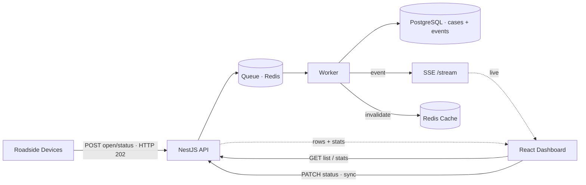

# Real-Time Traffic Incident Management Platform

Ingests traffic incidents from roadside devices as cases with a status timeline, processes
them through a queue, and streams them to an operator dashboard in real time.

## Live demo

| What | Link |
|---|---|
| **Dashboard** (operator UI) | https://enchanting-alpaca-23aca2.netlify.app |
| **Simulator** (generate traffic) | https://courageous-kitsune-bb938f.netlify.app |
| **Docs** (architecture guide) | https://courageous-kitsune-bb938f.netlify.app/docs |
| **API docs** (live Swagger) | https://scientechnic.madian.in/api/docs |

The frontends call the live backend at `https://scientechnic.madian.in`. Open the simulator,
generate some traffic, then switch to the dashboard to watch cases open and resolve live.

## Quick start

Three pieces run locally: the backend and infra (Docker), the dashboard, and the simulator.
Run each in its own terminal; the dev servers stay in the foreground. Start the backend first,
then each frontend from the repo root.

### Prerequisites

- **Docker** and **Docker Compose**: run the backend, PostgreSQL, and Redis.
- **Node 22** with **npm or pnpm**: run the dashboard and simulator. They form a pnpm workspace
  (what Netlify deploys), but each app also installs standalone, so either tool works locally.
  The SPAs build with Vite 8 (Node ≥ 20.19), matching the backend's `node:22-alpine`.

### 1 · Backend + infrastructure (Docker)

Postgres, Redis, and the API (which auto-migrates on boot):

```bash
docker compose up --build
```

- API → http://localhost:4000/api
- **Swagger (interactive API docs)** → **http://localhost:4000/api/docs**
- Override the port with `API_PORT=… docker compose up`.

### 2 · Dashboard (operator UI)

```bash
cd frontend
npm install     # or: pnpm install
npm run dev     # or: pnpm dev
```

→ http://localhost:5173

### 3 · Simulator (generate traffic)

```bash
cd simulator
npm install     # or: pnpm install
npm run dev     # or: pnpm dev
```

→ http://localhost:5174. Set a count, hit run, and flip to the dashboard to watch cases open
and resolve live. Scenarios and a headless CLI are under [Generate traffic](#generate-traffic).

### Local URLs

| | URL |
|---|---|
| Dashboard | http://localhost:5173 |
| Simulator | http://localhost:5174 |
| API (REST + SSE) | http://localhost:4000/api |
| **Swagger docs** | **http://localhost:4000/api/docs** |

> Prefer the backend with hot reload? `docker compose up -d postgres redis`, then
> `cd backend && cp .env.example .env && npm install && npm run db:migrate && npm run start:dev`.

## Overview

- **Backend**: NestJS, Drizzle (PostgreSQL), BullMQ, Server-Sent Events, Redis
- **Frontend**: React + Vite, TanStack Query, Recharts, Tailwind
- **Model**: an OPEN starts a case (the server returns its id); later status events update it
  in an append-only timeline. The current status is the latest event by event-time, so
  out-of-order arrivals (for example `ACKNOWLEDGED` after `RESOLVED`) don't regress it.
- **Pipeline**: device ingest is async (`POST open/status → queue → worker → cases+events →
  domain event → SSE + cache invalidation`). An operator's `PATCH status` is synchronous (no
  queue) and converges on the same fan-out.



The backend, Postgres and Redis run in Docker; the dashboard and simulator are standalone
static SPAs (run locally or deploy to Netlify/Vercel).

## Services & ports

| Service | Port | Runs in | Role |
|---|---|---|---|
| **Backend API** (NestJS) | 4000 | Docker | REST (ingest, list/filter, status update, stats), the SSE stream (`/api/stream`), and the BullMQ worker that persists queued incidents. Swagger at `/api/docs`. |
| **Dashboard** (React/Vite) | 5173 | local / Netlify-Vercel | Operator UI: incident table, filters, detail drawer, summary cards, live updates via SSE. |
| **Simulator app** (React/Vite) | 5174 | local / Netlify-Vercel | Generates incident traffic in the browser (`POST /incidents/batch`), with scenario controls and a configurable backend endpoint. |
| **PostgreSQL** | 5432 | Docker | Incident storage (`incidents` + `incident_events`). |
| **Redis** | 6379 | Docker | Backs the BullMQ ingestion queue and the statistics cache. |

The CLI generator (`backend/src/simulator/`) has no port; run it via `npm run simulate` or
`docker compose exec`.

## Generate traffic

Two ways to drive the real `POST /incidents/batch` ingestion path:

**Simulator app** (browser UI at http://localhost:5174). Interactive, with scenario controls.
Set the backend endpoint (defaults to `http://localhost:4000/api`), pick a count (presets
100 / 1,000 / 10,000, or type one), and choose one-shot or continuous mode. Progress % is the
share of opened cases advanced OPEN→ACKNOWLEDGED→IN_PROGRESS→RESOLVED. The inject out-of-order
toggle sends a case's status events in shuffled arrival order, which exercises the
latest-by-event-time rule. You can pin case attributes (severity, eventType, device, location).
Batch size is incidents per request (≤ 1000); rate is target incidents/sec, best-effort, and
the panel shows the actual achieved rate.

**CLI** (scripted, headless, CI). Opens cases in bulk (100 / 1k / 10k):

```bash
docker compose exec backend node dist/simulator/simulate.js --count=1000 --rate=50
# or locally from backend/:  npm run simulate -- --count=10000 --batch=200
```
Flags: `--count` (total), `--batch` (per request), `--rate` (incidents/sec; `0` = max), `--url`.

**Clear all data** wipes the `incidents` table, drains the ingestion queue, and resets the
stats cache. Same operation as the simulator's *Clear all data* button (`DELETE /api/incidents`):

```bash
docker compose exec backend node dist/db/clear.js
# or locally from backend/:  npm run db:clear
```

## Deploy to Netlify / Vercel

Both frontends are static SPAs. Each folder (`frontend/`, `simulator/`) ships its own
`netlify.toml` and `vercel.json` (build command, output dir, SPA fallback, Node 22).

**Netlify**: connect this repo. Netlify auto-detects the pnpm workspace and offers a dropdown
to pick which app to deploy. Create one site for the dashboard (`frontend`) and one for the
simulator (`simulator`); each builds via its own `netlify.toml`. On each site, set `VITE_API_URL`
(Site settings → Environment variables) to your deployed backend's URL (for example
`https://scientechnic.madian.in/api`); the apps default to localhost otherwise.

**Vercel**: import the repo twice, once per app, with Root Directory = `frontend` / `simulator`,
and set `VITE_API_URL` per project.

Then add each deployed origin to the backend's `CORS_ORIGIN` (comma-separated) so cross-origin
REST and SSE are allowed.

## How the frontend talks to the backend

Both channels use one base URL from [frontend/src/config.ts](frontend/src/config.ts)
(`VITE_API_URL`, default `http://localhost:4000/api`):

- **REST** → [api/client.ts](frontend/src/api/client.ts) → calls in [api/incidents.ts](frontend/src/api/incidents.ts)
- **SSE** (`${VITE_API_URL}/stream`) → [lib/stream.ts](frontend/src/lib/stream.ts) →
  [hooks/useIncidentStream.ts](frontend/src/hooks/useIncidentStream.ts)

To point at another backend, set `VITE_API_URL` in `frontend/.env` (local) or the platform's
env vars (deployed), then rebuild or restart.

## Project structure

```
backend/    NestJS API, queue worker, SSE stream, Drizzle schema, CLI generator, tests
frontend/   React dashboard: time-range presets, summary, time-series charts, case table
            + filters, case-detail timeline, live SSE updates (+ deploy configs)
simulator/  Standalone browser simulator app (lifecycle + out-of-order) + deploy configs
docs/       ARCHITECTURE.md, API.md, SCHEMA.md
docker-compose.yml
```

The dashboard's time-range presets (15m / 1h / 6h / 24h / 7d / All) re-scope the summary cards,
charts, and table together; opening a row shows its status timeline.

Backend modules: `incidents` (domain), `ingestion` (queue write-path), `stats`, `realtime`
(SSE stream), `cache`, `db`.

## Tests

```bash
cd backend && npm test         # unit (service, stats, processor)
cd backend && npm run test:e2e # API flow (needs Postgres + Redis running)
cd frontend && npm test        # component tests
```

## Documentation

- [Architecture review](docs/ARCHITECTURE.md): diagrams, design decisions, bottlenecks, scaling
- [API reference](docs/API.md): endpoints (live Swagger at `/api/docs`)
- [Database schema](docs/SCHEMA.md): model, indexes, ERD
