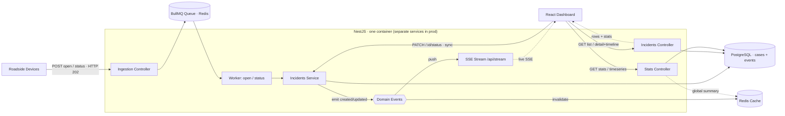
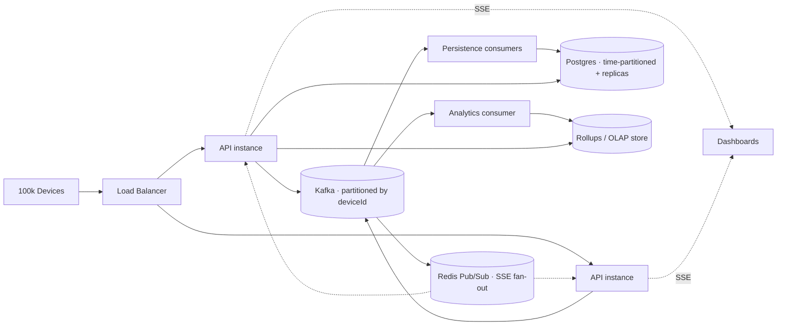

# Architecture Review

## 1. System Architecture

An incident is a case with an append-only status timeline. Producers report two kinds of event
to an ingestion endpoint that acknowledges immediately (HTTP 202) and enqueues them
(Redis/BullMQ). A worker applies each event: an OPEN creates the case (id plus first timeline
event); a status event appends to the timeline and recomputes the current status
(latest-by-event-time, so out-of-order arrivals don't regress it). The worker emits an
in-process domain event; independent listeners push it over SSE and invalidate the stats cache.
Reads (list, detail with timeline, windowed stats, time-series) are served from Postgres through
the API; the global summary is cached in Redis. Operators resolve cases with a synchronous
`PATCH` (no queue) that converges on the same domain-event fan-out. See the
[two write paths](#2-design-decisions).

> **One process here.** Ingestion, the read/query API, the SSE stream, and the BullMQ worker all
> run in a single NestJS container. In production these would split into independently deployable,
> independently scalable services (ingestion, query API, realtime, worker). The module-per-concern
> layout and the domain-event seam are the cut-lines that make that split straightforward. The
> diagram below boxes everything that runs in the one process.



### Ingestion data flow (open then an out-of-order status)

```mermaid
sequenceDiagram
    participant D as Device / Simulator
    participant API as Ingestion API
    participant Q as BullMQ (Redis)
    participant W as Worker
    participant DB as PostgreSQL

    D->>API: POST /incidents (open)
    API-->>D: 202 { id }
    API->>Q: enqueue open
    Q->>W: deliver open
    W->>DB: create case + OPEN event (status=OPEN)

    D->>API: POST /incidents/:id/events (RESOLVED @ t2)
    W->>DB: append event; t2 > last_event_at → status=RESOLVED
    D->>API: POST /incidents/:id/events (ACKNOWLEDGED @ t1 < t2)
    W->>DB: append event; t1 ≤ last_event_at → recorded, status stays RESOLVED
```

## 2. Design Decisions

| Decision | Rationale |
|---|---|
| **Cases + event timeline** | Status changes are updates to a case, not new incidents. A denormalized current `status` (fast filtering and stats) is backed by an append-only `incident_events` log (history and audit). Modeling incidents as separate rows per status was the bug this fixes. |
| **Out-of-order tolerance** | The current status is derived from the event with the latest event-timestamp (tracked via `last_event_at`), so a late `ACKNOWLEDGED` after `RESOLVED` is recorded but never regresses the case. Real device and queue networks reorder; the model is order-independent. |
| **Case id: client-optional UUIDv7, idempotent open** | The producer may supply a UUID (correlation/idempotency key) reused across the case's events; the server generates a UUIDv7 if omitted and returns it. The open insert is `on conflict do nothing`, so BullMQ retries can't double-create. UUIDv7 is time-ordered, so it indexes with good locality. |
| **Queue-based ingestion (HTTP 202)** | Decouples request handling from DB writes. Traffic spikes are absorbed by the queue instead of overwhelming Postgres, and the API stays responsive. Trade-off: reads are eventually consistent (incidents appear once the worker drains them). Status events retry with backoff, so they tolerate arriving before their open commits. |
| **Two write paths (async ingest, sync operator)** | Device ingestion is asynchronous (queued, returns HTTP 202); an operator's `PATCH /incidents/:id/status` is synchronous (applied immediately, returning the updated case). Both append to the timeline and emit the same domain event, so the SSE and cache fan-out is identical. |
| **In-process domain events** | The service emits `incident.created/updated`; the SSE stream and cache invalidator are decoupled listeners. New reactions (audit log, notifications) can be added without touching the write path. This is also the seam where an external broker would later plug in. |
| **SSE for real-time** (see comparison below) | The feed is one-directional (server to client), so Server-Sent Events fit better than WebSocket and far better than polling. |
| **NestJS module-per-concern** | Clear separation: `incidents` (domain), `ingestion` (write path), `stats`, `realtime`, `cache`, `db`. Controllers stay thin; business logic sits in services; data access sits in a repository. |
| **NestJS over plain Express** | Express is the framework I know best, but this system needs an SSE stream, a queue worker, and a decoupled event bus wired cleanly and testably. NestJS runs on the Express adapter it already uses under the hood (`NestExpressApplication`) and gives these first-class and DI-managed: `@Sse()` for realtime, `@nestjs/bullmq` `@Processor`/`WorkerHost` for the in-process worker, and `@OnEvent` for the domain-event seam. It keeps the Express HTTP layer I'm fluent in and adds the structure those parts would otherwise need hand-rolled. |
| **Drizzle ORM** | Type-safe, SQL-transparent queries and a schema file that doubles as documentation. No hidden query magic. |
| **Redis for queue + cache** | One dependency serves both the BullMQ queue and the statistics cache, and could fan out SSE across instances via Pub/Sub at scale. |
| **Stats cache: TTL + invalidation** | Statistics aggregate the whole table, so they are cached. Every write invalidates the cache via the domain event, so the dashboard never shows stale totals beyond the next read. |
| **Structured logging (pino)** | JSON logs with per-request correlation, ready for aggregation in production. |
| **Validation at the edge** | `class-validator` DTOs and a global `ValidationPipe` reject malformed payloads before they reach business logic; a global exception filter returns one consistent error shape. |
| **Simulators are pure API clients** | Both the browser simulator app and the CLI generator only call `POST /incidents/batch`, so they exercise the real pipeline (queue, worker, DB, SSE) instead of a mock. What you see while simulating is the production path. |
| **Backend bundled, dashboard on the edge** | The backend is a long-lived Node process (Postgres/Redis connections, live SSE sockets, the worker), so it ships as one reproducible Docker Compose deployable. The dashboard has no server runtime, so it builds to static files on a CDN/edge: cheap, scales to many operators for free, low-latency, and deploys decoupled. It only needs `VITE_API_URL`. SSE is plain HTTP, so it stays CDN/proxy-friendly. |

### Real-time transport: SSE vs REST polling vs WebSocket

The dashboard needs newly received incidents without a manual refresh, a purely server-to-client
push. The client never sends anything over the channel (status changes go through
`PATCH /incidents/:id/status`). Given that, SSE wins on both fronts:

| | REST polling | WebSocket | **SSE (chosen)** |
|---|---|---|---|
| **Latency** | Up to one poll interval | Instant push | Instant push |
| **Server / network load** | High: every dashboard re-fetches on a timer even when idle | Low | Low: one long-lived response, data sent only when something changes |
| **Directionality** | Request/response | Bidirectional | Server to client (all we need) |
| **Complexity** | Trivial but wasteful | Upgrade handshake, separate protocol, sticky sessions to scale | Plain HTTP `GET`; native `EventSource` auto-reconnect; no handshake |
| **Infra / CDN-friendliness** | Anywhere | Needs WS-aware proxies/LB | Standard HTTP: proxy/CDN/LB friendly, pairs well with a separately-hosted SPA |

- **vs REST polling:** one push beats N polls: lower latency and no constant re-fetching by
  thousands of idle dashboards.
- **vs WebSocket:** same instant delivery with less moving machinery; we use none of WebSocket's
  bidirectional or binary capabilities. WebSocket would win if clients needed to stream to the
  server, send binary frames, or required sub-protocols. None of those apply here.

## 3. Potential Bottlenecks

| Area | Bottleneck | Mitigation in design / next step |
|---|---|---|
| **Ingestion API** | Synchronous DB writes per request would cap throughput. | Already mitigated: the API only enqueues. Scale further by running multiple stateless API instances behind a load balancer. |
| **Database writes** | Each event writes a case row (open) or an event row plus a small case update (status); the append-only `incident_events` log grows fastest. | Worker concurrency is configurable; next steps are batched inserts in the worker, time-partitioning the log, and retention/rollups. |
| **Database reads / reporting** | Windowed stats and time-series aggregate over the cases/events tables as they grow. | Backed by composite indexes on `occurred_at`; the global summary is cached. Next: pre-aggregated rollups or TimescaleDB continuous aggregates, plus read replicas. |
| **SSE fan-out** | A single process holds all SSE connections in memory and only sees its own in-process events. | Run stateless API instances and publish domain events over Redis Pub/Sub (or Kafka) so every instance can push to its own connected clients. SSE needs no sticky sessions. |
| **Memory / client flood** | Large `pageSize`; pushing one SSE message per incident floods clients during a 10k-case run. | `pageSize` is capped at 100; the SSE stream coalesces incident activity into a periodic count (~2/sec) rather than per-incident pushes, so clients get a handful of messages and refetch, not tens of thousands. |

## 4. Time-series & scaling

### Time-series approach

The dashboard's windowed stats and charts (opened-by-severity, opened/resolved, and
currently-open over time) are computed on demand in plain PostgreSQL with the built-in
`date_bin` function (arbitrary bucket widths, from minute to day) over the composite
`occurred_at` indexes. Buckets map from the selected time-range preset. Windowed reads are
computed live (always fresh, indexed); only the global "All" summary is cached and invalidated
on writes, since a sliding window would never hit a cache key anyway. `active` (currently-open)
is a running cumulative `baseline + Σ(opened − resolved)`.

**Do we need TimescaleDB at 100k?** Not because of the device count. TimescaleDB is a Postgres
extension (hypertables) reached for on reporting cost, not headcount. Base Postgres,
time-partitioned (`pg_partman` plus `pg_cron` for partitions and retention) with read replicas,
stays the OLTP source of truth for cases and list/detail reads, and handles 100k-device volume
with batching and partitioning. The pressure point is charting: computing `date_bin` buckets
live over an event log of hundreds of millions to billions of rows scans too much, because the
charts span wide time ranges. Continuous aggregates fix that by maintaining the rollups
incrementally on write, and compression shrinks old chunks, so charts read small pre-aggregated
tables instead of the hot log. The lighter first step is hand-rolled rollup tables refreshed by a
consumer, with no new dependency; TimescaleDB is the Postgres-native option (same SQL and drivers,
no app rewrite). So keep Postgres for OLTP, and add Timescale (or rollups) for reporting only when
live aggregation exceeds the latency budget. None of it requires app changes beyond the query layer.

### Scaling strategy

From 100 to 100,000 devices (100× incident volume), the same shape scales out:

1. **Stateless API horizontally** behind a load balancer; nothing is held in process except
   transient SSE connections.
2. **Swap BullMQ for Kafka** when a durable, partitioned, replayable log and multi-consumer
   fan-out are needed. The domain-event seam means consumers (persistence, analytics,
   notifications) scale independently. Partition by `deviceId` to preserve per-device ordering.
3. **Database**: range-partition `incidents` by time, add read replicas for list/stats queries,
   and batch inserts in the worker.
4. **Reporting**: move statistics to pre-aggregated rollups (or a time-series / OLAP store)
   updated by a consumer, so reads never scan the hot table.
5. **Real-time**: fan out SSE across API instances by publishing domain events over Redis Pub/Sub
   (or Kafka); each instance streams to its own connections.
6. **Caching**: Redis already fronts statistics; extend it to hot list queries.



> These are the scale-out targets; the implementation here runs the single-node version (BullMQ,
> one Postgres, one Redis) end-to-end.
