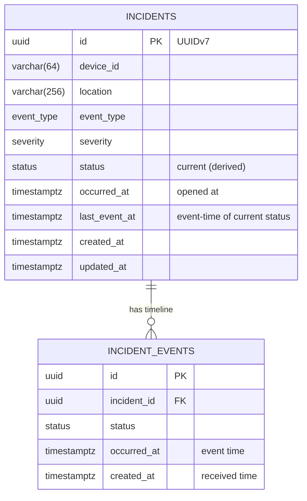

# Database Schema

A traffic incident is a case (`incidents`) with an append-only status timeline
(`incident_events`). The schema lives in
[`backend/src/db/schema.ts`](../backend/src/db/schema.ts); SQL migrations are generated by
Drizzle Kit into `backend/src/db/migrations/`.

## Entities

### `incidents` (the case)
One row per incident. `id` is a UUIDv7 (time-ordered, so it indexes with good locality), supplied
by the producer or generated server-side. `status` is the current status, derived from the
timeline; `last_event_at` is the event-time of the event that set it.

### `incident_events` (the timeline)
One append-only row per reported status (including the initial `OPEN`). `incident_id` is a
foreign key with `ON DELETE CASCADE`, so clearing a case removes its events.

## Out-of-order handling

When a status event arrives, it is appended to `incident_events`; the case's current status is
updated only if the event's `occurred_at` is later than `last_event_at`. So a late
`ACKNOWLEDGED` arriving after `RESOLVED` is recorded in the timeline but does not regress the
case. `last_event_at` is the running maximum event-time, so the current status always reflects
the globally-latest event regardless of arrival order.

## Indexes

| Table | Index | Backs |
|---|---|---|
| incidents | `device_id`, `severity`, `status` | list filters |
| incidents | `occurred_at DESC` | default ordering + time-window filter |
| incidents | `(severity, occurred_at)` | severity volume time-series |
| incidents | `(status, occurred_at)` | status + windowed queries |
| incident_events | `incident_id` | load a case's timeline |
| incident_events | `occurred_at`, `(status, occurred_at)` | resolved-per-bucket time-series |

Enums (`event_type`, `severity`, `status`) are native Postgres enum types.

## Scaling note

The tables are time-ordered and append-heavy. The next steps under high volume are time-based
range partitioning on `occurred_at` (monthly partitions keep indexes small and make archival
cheap) and pre-aggregated rollups, or TimescaleDB for the time-series. See
[ARCHITECTURE.md](./ARCHITECTURE.md#4-time-series--scaling).
